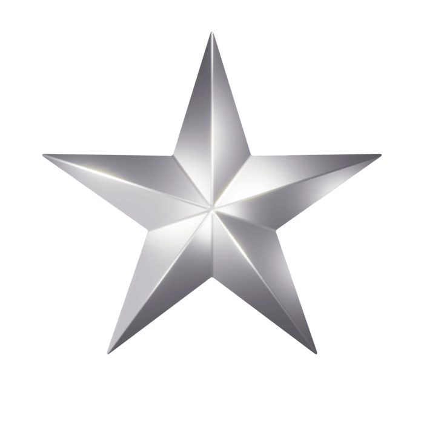

---

# ¡Hola, soy Laura! 🌀

>
>#### "El código más bonito es el que se entiende a la primera."
>

)
>
>#### "El código más bonito es el que se entiende a la primera."
>

---

### Lenguajes & Frameworks 

### Herramientas

## 🌑 Tabla de Intenciones de Aprendizaje

| Tecnología / Concepto            | Estado        | Prioridad |
|---------------------------------|---------------|-----------|
| HTML5 semántico avanzado         | En progreso   |  Media  |
| CSS3 animaciones & Flexbox/Grid  | En progreso   |  Media  |
| C# orientado a objetos           | En progreso   |  Alta  |
| MariaDB & SQL avanzado           | En progreso   |  Media  |
| Git & GitHub avanzado            | En progreso   |  Alta  |

## ¿Dónde encontrarme?

---

